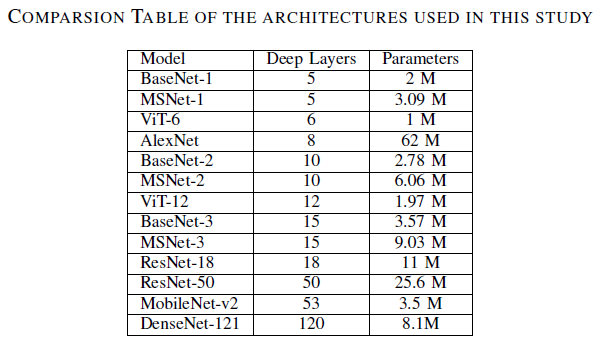
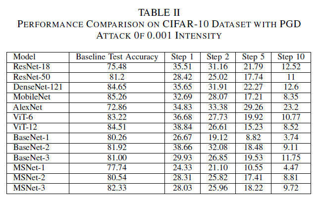
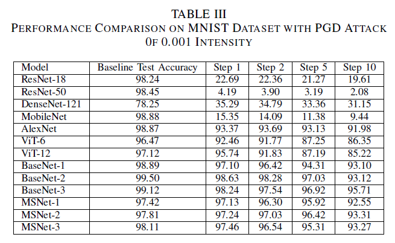
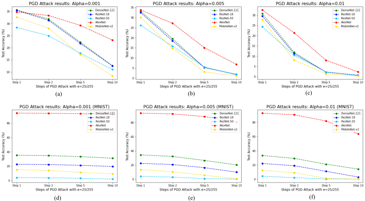
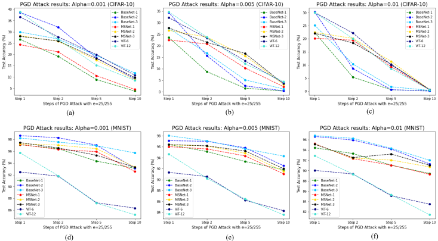

# Towards-Exploring-Architectural-Insights-of-DNNs-ViTs-through-the-lens-of-Adversarial-Robustness
The Authors of thiis project are: @Sumedh-Joshi123 and @AmoghJ001.

In this research project, we aim to discover insights into the architectural nuances of DNN and ViTs and compare their robustness solely based on their architecture. Comprehensive experiments involving 13 different architectures on two benchmark datasets: CIFAR-10 and MNIST help us find conclusive evidences
to support our findings.

# Contributions
Along with performing comprehensive experiments on ImageNet models and Vision Transformers, we propose two novel architecture families:
1) BaseNet Family (BaseNet-1,  BaseNet-2, BaseNet-3)
2) MultiScaleNet (MSNet) Family: (MSnet-1, MSNet-2, MSNet-3)

The figures below illustrate our two proposed models: BaseNets and MSNets.

# Experiments
To test the adversarial robustness of different architectures considered in this study, we perform PGD attacks of varying intensities: 0.001, 0.005, 0.01 in varying steps of 1,2,5 and 10 for all the models for the two datasets each.
The experiments are performed along two major themes:
1) Understanding the effect of increase in architectural depth in terms of layers on the adversarial robustness
2) Understanding the effect of increase in parameters on the adversarial robustness of the model

The table below compares all the models based on their depth and parameters.

# Results
The experimental results of the adversarial tests performed for 0.001 intensity are summarized in the Table 2 and Table 3 for CIFAR-10 and MNIST Datasets respectively. 

The Figures below summarize the results of all the experiments in the form of graphical visualizations. 

Figure 3: Performance of ImageNet models on (a)-(c) CIFAR-10 and (d)-(f) MNIST Datasets

Figure 4: Performance of BaseNets, MultiScale-Nets and Vision Transformers (ViTs) on (a)-(c) CIFAR-10 and (d)-(f) MNIST Datasets

