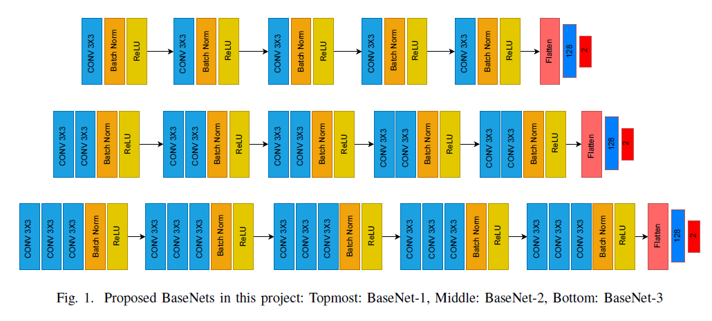
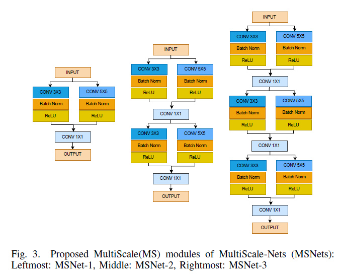

# Towards-Exploring-Architectural-Insights-of-DNNs-ViTs-through-the-lens-of-Adversarial-Robustness
The Authors of thiis project are: @Sumedh-Joshi123 and @AmoghJ001
In this research project, we aim to discover insights into the architectural nuances of DNN and ViTs and compare their robustness solely based on their architecture. Comprehensive experiments involving 13 different architectures on two benchmark datasets: CIFAR-10 and MNIST help us find conclusive evidences
to support our findings.

# Contributions
Along with performing comprehensive experiments on ImageNet models and Vision Transformers, we propose two novel architecture families:
1) BaseNet Family (BaseNet-1,  BaseNet-2, BaseNet-3)
2) MultiScaleNet (MSNet) Family: (MSnet-1, MSNet-2, MSNet-3)
The figures below illustrate our two proposed models: BaseNets and MSNets.

